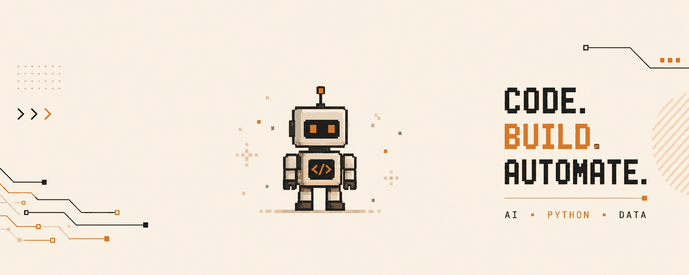

 
<h1>RUDRANSH</h1>
<b>AI / ML enthusiast &nbsp;▪&nbsp; Data Analytics &nbsp;▪&nbsp; turning ideas into working systems</b>
  

  

**AI and Automation Enthusiast** with hands-on experience building Python-based solutions that simplify complex workflows and drive operational efficiency. I specialize in developing intelligent automation scripts, data mining pipelines, and web scraping tools that extract, process, and analyze information at scale.

Proficient in **Python, Playwright, Selenium, and GPT APIs**, I combine AI models with automation frameworks to build smart, scalable, real-world-ready solutions. I am actively expanding my expertise in machine learning fundamentals, natural language processing, and the practical integration of AI into business operations.

I am driven by curiosity and a problem-solving mindset, and I focus on delivering systems that save time, reduce costs, and help businesses scale through intelligent technology.

- 💼 Role: Tech Enthusiast &amp; Business Analyst
- 🤖 Focus: AI, automation, and intelligent data pipelines
- 🛠️ Tools: Python, Playwright, Selenium, GPT APIs
- 🎯 Exploring: ML fundamentals &amp; NLP
- 🚀 Mission: Build systems that save time, cut costs, and drive growth

 

  

 

  

  

  

                                        

  

  

  

  

 

  

 
<b>CODE.</b> <b>BUILD.</b> <b>AUTOMATE.</b>

